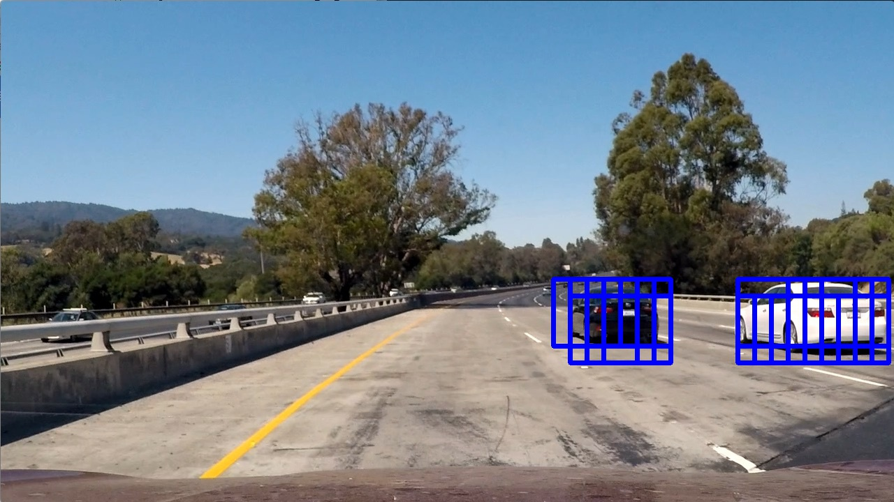

#Vehicle Detection Project

The goals / steps of this project are the following:

* Perform a Histogram of Oriented Gradients (HOG) feature extraction on a labeled training set of images and train an SVM classifier
* Transform and append binned color features, as well as histograms of color, to your HOG feature vector. 
* Normalize the features and randomize a selection for training and testing.
* Implement a sliding-window technique and use the trained classifier to search for vehicles in images.
* Run the pipeline on a video stream and create a heat map of recurring detections frame by frame to reject outliers and follow detected vehicles.
* Estimate a bounding box for vehicles detected.


## Files in the Project  
* _main.py_     Program main.  It splits the video frames and sends them to Pipeline in _vehicle_detection_pipeline.py_.
* _vehicle_detection_pipeline.py_      Pipeline class applying Color Binning and HOG to every image to extract features 
                                        for SVM classification (_classifier.py_).  Pipeline obtains SVC from a pickle 
                                        in _svc_model_32_sqrt.p_.
* _classifier.py_       SVM classifier trained on the images in _training_.  SVC stores the model in _svc_model_32_sqrt.p_.
* _training_            SVC training images.
* _convert_png_jpg.py_  A script to convert png images into jpeg - make the images inline with test images to avoid the 
                        confusion.  In retrospect, a better approach would have been to convert the images after reading.
* _svc_model_32_sqrt.p_     Model output by _classifier.py_ for the use by Pipeline  (Not included due to the github commit size limit)
* _debug_pipeline.py_       A file used to read a sequence of images and debug the pipeline.
* _project_video_out.mp4_   Final annotated video.
* _test_images_             Images to test on
* _test_video_out.mp4_      A short annotated test video output.
* _utils.py_                Color binning and hog functions adopted from the lectures.
* _README.md_               This file


## Training the SVM Classifier (SVC)
The most important part of the project is feature extraction.  It was used to train the SVM classifier as well
as processing images coming from the video.  To extract teh features, I applied Histogram of Oriented Gradient 
as well as Color Binning as was suggested in the lectures.

To train SVC, I started by reading in all the [vehicle](https://s3.amazonaws.com/udacity-sdc/Vehicle_Tracking/vehicles.zip) 
and [non-vehicle](https://s3.amazonaws.com/udacity-sdc/Vehicle_Tracking/non-vehicles.zip) images from the data 
provided by Udacity (_classifier.py_:13-25).  Here are the examples of the images.


Then, I extracted the training image features (_classifier.py_:38-56).  
The code extracting the HOG features is in the `get_hog_features()` method in [utils.py](./utils.py).  It uses `skimage.hog()` implementation from
the scikit-learn library.   The code extracting the image color features is in `color_hist()` and in `bin_spatial()` in [utils.py](./utils.py).
Most of the code was adopted from the lectures.  All I did was experimenting with the different HOG vector `orientation`, HOG 
`pixels_per_cell` numbers, color spaces, and color bin sizes.

Here are the heatmaps of the HOG of the car and non-car images:


Before passing the code to the classifier, I split the features into training and testing sets and scaled/normalized the data.  
The data normalization was done to prevent some feature values from skewing the learning due to the features' large values.
The testing set was used to score the SVC model's accuracy.  

Based on the most consistent and best output from the SVM classifier (SVC), I chose `YCrCb` color space and HOG parameters of 
`orientations=8`, `pixels_per_cell=(8, 8)` and `cells_per_block=(2, 2)`.  The final SVC accuracy was more than 99% on the randomly 
split test set.

The most pronounced breakthrough in SVC's accuracy came from tweaking the classifier's paramerters.  I used `sklearn.GridSearchCV` to 
automatically explore the best combination of the SVM's `C` regularization/overfitting parameter (range 1-10) and the SVM's kernels
(`linear` or `rbf` non-linear).  

Linear Classifier results:
```
Data: 8792 cars, 8968 non-cars
Using: 9 orientations 8 pixels per cell and 2 cells per block
Feature vector length: 6108
668.87 Seconds to train SVC...
Test Accuracy of SVC =  0.9876
```
Classifier results based on the parameters selected by `sklearn.GridSearchCV`:
```
Data: 8792 cars, 8968 non-cars
Using: 9 orientations 8 pixels per cell and 2 cells per block
Feature vector length: 6108
2166.34 Seconds to train SVC...
Test Accuracy of SVC =  0.9935
```

The code training the classifier and saving the model to a pickle file is in [classifier.py](./classifier.py):73-96

## Sliding Window Search

Next part of the project was to apply the classifier to the images in the test directory, test video, and eventually the longer project video.
In order to apply the classifier, I had to present it with the features collected the same way from the same size images as during training.
The classifier was trained on the 64-by-64 pixel images, which locked the search window size at 64-by-64 pix.  I varied the image scale in order to zoom-in 
(decrease `scale` param) or zoom-out (increase `scale` param).  The scaling accounted for the fact that the closer objects appear much larger. 

Since we know that cars can appear only in a limited region of the frame, I limited the search to an area between the horizon (400 pix) and the hood of the 
car (656 pix).  By experimenting, I split the region further into a front area (551 - 656 pix) where I used 1.5 scale (window size 96x96 pix) and a posterioir 
area (400 - 550 pix) where I used a scale of 1 (64x64 pix window).

Each sliding window overlapped with the previous window by 16 pixels or 2 cells, as specified by `cells_per_step` parameter in the code.

Here is an image of all the sliding windows taken on a frame:
 

In each sliding windows, I ran an SVM classifier.  If the classifier predicted a car in the image, I recorded the window's location.
You can find the sliding window search code in `_find_cars()` in [vehicle_detection_pipeline.py](./vehicle_detection_pipeline.py).  

After I recorded all the positive identifications, I ran a heatmap algorithm adding 1 at each pixel, which is a part of the positive car detection window.
Since a car could be detected by multiple overlapping windows, the sum accumulated around the car region of an image could be far greater than 1.
I applied thresholding (sum >= 2) to eliminate any detection noise.

Here is an image of all positive identification windows:

There were no false positive car identification windows in this particular frame, but you could see that the outside pixels of the edge windows would 
be clipped due to accumulating less heat.

Here is heatmap image of those detections with the red areas having more detections than those that are whiter:


And finally, here is the final image after filtering the lower number of detection pixels and bounding those area in a box:
 

The code for the applying the heat maps could be found in `detect_cars()` in [vehicle_detection_pipeline.py](/vehicle_detection_pipeline.py).

## Video Implementation

I successfully applied the pipeline to the test and the project videos.
You can find them here: [test_video_out.mp4](test_video_out.mp4), [project_video_out.mp4](project_video_out.mp4)

## Discussion

The sliding window implementation is extremely slow.  It also has a few false positive detections  in the project video 
on the left-hand side.  I could have played with the window sizes (image scales) and with SVM parameters, but the bottom
line is that the algorithm is not very robust for an application in an autonomous vehicle.

It appears that a deep neural network implementation (CNN) might be better suited for the image segmentation and object 
identification.  CNN is much more scalable as it learns its parameters instead of the humans trying to experiment with
the different values.

